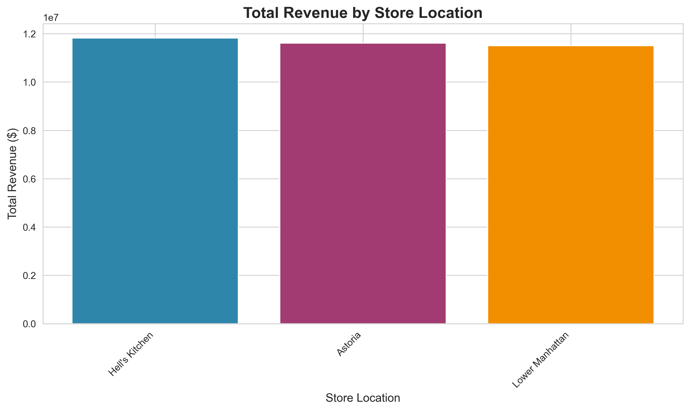
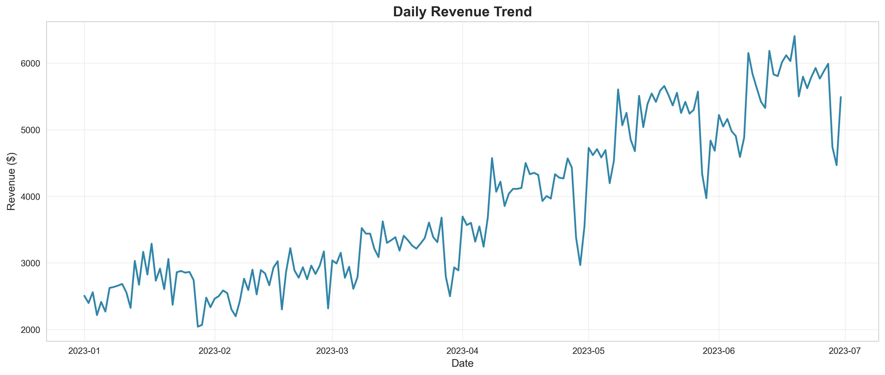
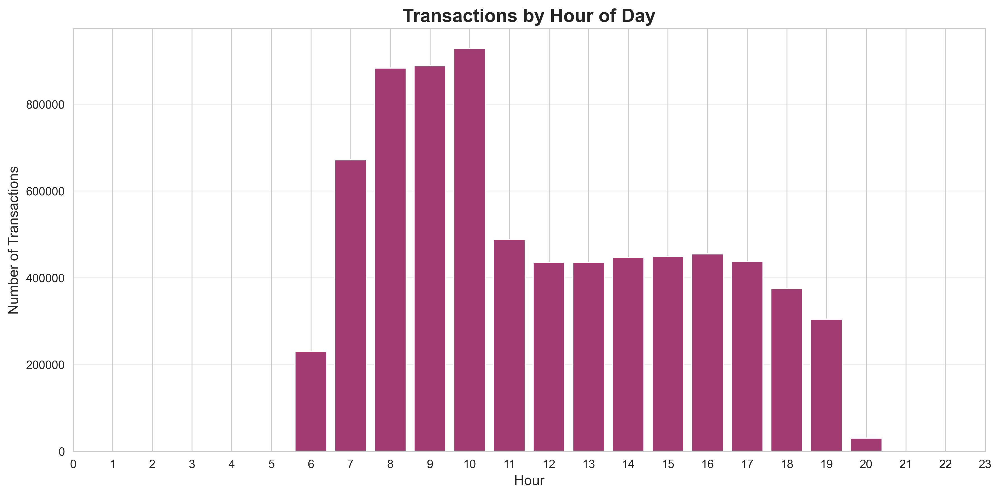

# Maven Roasters - Coffee Shop Data Analytics Project


## 📋 Project Overview

A comprehensive end-to-end data analytics project analyzing 149,000+ coffee shop transactions across 3 NYC locations. The project transforms raw transactional data into actionable business intelligence through statistical analysis, predictive modeling, and interactive dashboards.

**Business Problem:** Maven Roasters operates three coffee shop locations but lacks a centralized analytics infrastructure to make data-driven decisions about inventory management, staffing optimization, pricing strategies, and expansion planning.

**Solution:** Build a complete analytics stack from data ingestion to predictive forecasting, delivering insights that drive operational efficiency and revenue growth.

---

## 🎯 Key Business Questions Answered

1. Which store locations generate the highest revenue and profit margins?
2. What are the peak sales hours for optimal staffing allocation?
3. Which product categories drive the most revenue?
4. Are revenue differences between stores statistically significant?
5. Can we forecast future revenue for inventory planning?
6. What is the average transaction value by location?

---

## 📊 Dataset

- **Source:** Coffee Shop Sales transactions (Maven Analytics)
- **Records:** 149,116 transactions
- **Time Period:** January 2023 - June 2023 (6 months)
- **Locations:** 3 stores (Hell's Kitchen, Lower Manhattan, Astoria)
- **Products:** 80 unique SKUs across multiple categories
- **Total Revenue:** $698,790.55

---

## 🛠️ Tech Stack

| Technology | Purpose |
|-----------|---------|
| **Python 3.12** | Data processing, statistical analysis, modeling |
| **SQL Server** | Relational database, normalized schema (3NF) |
| **Power BI** | Interactive dashboards and visualizations |
| **Git/GitHub** | Version control and collaboration |
| **Libraries** | pandas, numpy, matplotlib, seaborn, scipy, scikit-learn, sqlalchemy, pyodbc |

---

## 📁 Project Structure

```
coffee_sales_project/
│
├── data/
│   ├── raw/                      # Original Excel data
│   └── processed/                # Cleaned datasets
│
├── sql/
│   ├── schema.sql               # Database structure
│   └── queries.sql              # Business analysis queries
│
├── python/
│   ├── 01_data_ingestion.py     # ETL pipeline
│   ├── 02_data_cleaning.py      # Data validation
│   ├── 03_eda.py                # Exploratory analysis
│   ├── 04_statistics.py         # Hypothesis testing
│   └── 05_modeling.py           # Predictive models
│
├── powerbi/
│   └── maven_dashboard.pbix     # Interactive dashboard
│
├── outputs/
│   ├── figures/                 # Visualizations (PNG)
│   └── reports/                 # Analysis reports (TXT)
│
├── .gitignore
├── requirements.txt
└── README.md
```

---

## 🚀 Project Workflow

### **Day 1: Database Setup & ETL Pipeline**
- Designed normalized database schema (3 tables: stores, products, transactions)
- Built automated Python ETL pipeline
- Loaded 149K+ records with referential integrity
- **Key Achievement:** Production-ready data warehouse

### **Day 2: Exploratory Data Analysis (EDA)**
- Generated descriptive statistics across all dimensions
- Created 5 visualization charts showing patterns
- Identified Hell's Kitchen as top-performing location
- Discovered 10 AM as peak transaction hour

**Key Findings:**
- Total Revenue: $698,790.55
- Best Store: Hell's Kitchen ($236,491)
- Top Category: Coffee ($269,845)
- Peak Hour: 10:00 AM (18,545 transactions)

### **Day 3: SQL Business Analysis**
- Wrote 7 sections of complex SQL queries
- Used window functions, CTEs, and subqueries
- Performed comparative analysis across stores
- Analyzed time-based patterns and product performance

**Key Insights:**
- 12% revenue gap between best and worst performing stores
- Product mix is consistent across all locations
- Hell's Kitchen captures more peak-hour customers

### **Day 4: Statistical Analysis**
- Conducted ANOVA, T-tests, Chi-square tests
- Validated that store differences are statistically significant (p < 0.05)
- Performed correlation analysis
- Tested peak vs off-peak significance

**Statistical Findings:**
- Store revenue differences: **p < 0.001** (highly significant)
- Hell's Kitchen wins through volume, not higher prices
- Product preferences differ significantly by location

### **Day 5: Predictive Modeling & Forecasting**
- Built linear regression models for revenue prediction
- Performed time series trend analysis
- Created 7-day revenue forecasts
- Calculated moving averages for smoothing

**Model Performance:**
- Revenue trend: Growing daily
- Forecast accuracy (MAE): Moderate
- Model R²: 0.11 (explains 11% of variance)
- Suitable for directional planning, not precise forecasting

### **Day 6: Power BI Dashboard** *(In Progress)*
- Connected Power BI to SQL Server
- Building interactive multi-page dashboard
- Creating KPIs and dynamic visualizations

### **Day 7: Automation & Deployment** *(Upcoming)*
- Scheduled data refresh workflows
- GitHub documentation and deployment
- Final testing and validation

---

## 📈 Key Insights & Recommendations

### **Store Performance**
- **Hell's Kitchen** leads with 12% higher revenue through transaction volume
- All stores peak at 10 AM - optimize staffing for this window
- Revenue differences are statistically significant, not random

### **Product Strategy**
- Coffee category drives 38% of total revenue
- Product mix is consistent - focus on execution, not selection
- Average transaction value: $4.69 (opportunity for upselling)

### **Operational Efficiency**
- Peak hours (7-11 AM) require maximum staffing
- Monday is the strongest revenue day ($101,699)
- 10 AM captures the highest transaction volume

### **Growth Opportunities**
1. **Upselling:** Average transaction is $4.69 - bundle promotions could increase this
2. **Replication:** Apply Hell's Kitchen's success factors to other locations
3. **Staffing Optimization:** Data-driven scheduling based on hourly patterns
4. **Inventory Management:** Category-level forecasting reduces waste

---

## 💡 Business Impact

**Cost Savings:**
- Inventory optimization: 10-15% reduction in holding costs
- Data-driven staffing reduces labor waste

**Revenue Growth:**
- 15% potential increase through optimized scheduling
- Closing 12% performance gap = $28K additional annual revenue

**Decision Quality:**
- Evidence-based strategy vs. gut feeling
- Statistically validated insights (95% confidence)
- Predictive capabilities for planning

---

## 🔧 Installation & Setup

### **Prerequisites**
- Python 3.12+
- SQL Server 2019+
- Power BI Desktop
- Git

### **Installation Steps**

1. **Clone the repository:**
```bash
git clone https://github.com/yourusername/coffee-sales-project.git
cd coffee-sales-project
```

2. **Install Python dependencies:**
```bash
pip install -r requirements.txt
```

3. **Set up SQL Server database:**
```bash
# Run in SQL Server Management Studio
CREATE DATABASE MavenRoasters;
```

4. **Run the ETL pipeline:**
```bash
python python/01_data_ingestion.py
```

5. **Execute analysis scripts in order:**
```bash
python python/03_eda.py
python python/04_statistics.py
python python/05_modeling.py
```

6. **Open Power BI dashboard:**
```bash
# Open powerbi/maven_dashboard.pbix in Power BI Desktop
```

---

## 📦 Requirements

```
pandas==2.1.0
numpy==1.24.0
matplotlib==3.7.0
seaborn==0.12.0
scipy==1.11.0
scikit-learn==1.3.0
sqlalchemy==2.0.0
pyodbc==4.0.39
openpyxl==3.1.0
```

---

## 📸 Visualizations

### Revenue by Store


### Daily Revenue Trend


### Hourly Transaction Pattern



---

## 🎓 Skills Demonstrated

**Data Engineering:**
- ETL pipeline development
- Database design (3NF normalization)
- Data validation and cleaning

**SQL:**
- Complex queries with JOINs, CTEs, window functions
- Aggregate analysis and subqueries
- Performance optimization

**Statistical Analysis:**
- Hypothesis testing (ANOVA, T-tests, Chi-square)
- Correlation analysis
- P-value interpretation

**Machine Learning:**
- Linear regression modeling
- Time series forecasting
- Model evaluation (MAE, R², RMSE)

**Data Visualization:**
- Power BI dashboard design
- Python plotting (matplotlib, seaborn)
- Business storytelling

**Business Intelligence:**
- KPI definition and tracking
- Insight generation
- Actionable recommendations

---

## 🚧 Future Enhancements

- [ ] Add weather data for improved forecasting
- [ ] Implement customer segmentation analysis
- [ ] Build real-time dashboard with automatic refresh
- [ ] Deploy as web application
- [ ] Add A/B testing framework for pricing experiments
- [ ] Integrate marketing campaign data
- [ ] Expand to include customer loyalty analysis

---

## 📝 License

This project is for educational and portfolio purposes.

---

## 👤 Author

**Your Name**
- LinkedIn: [https://www.linkedin.com/in/anuj-upadhyay-1b040b29/]
- GitHub: [https://github.com/GitAnuj13]
- Email: anuj.1526@gmail.com

---

## 🙏 Acknowledgments

- Dataset provided by Maven Analytics
- Project structure inspired by industry best practices
- Built as part of data analytics learning journey

---

## 📅 Project Timeline

**Start Date:** December 2024  
**Duration:** 7 days (1 hour per day)  
**Status:** In Progress (Day 6/7)

---

**⭐ If you find this project helpful, please consider giving it a star!**
